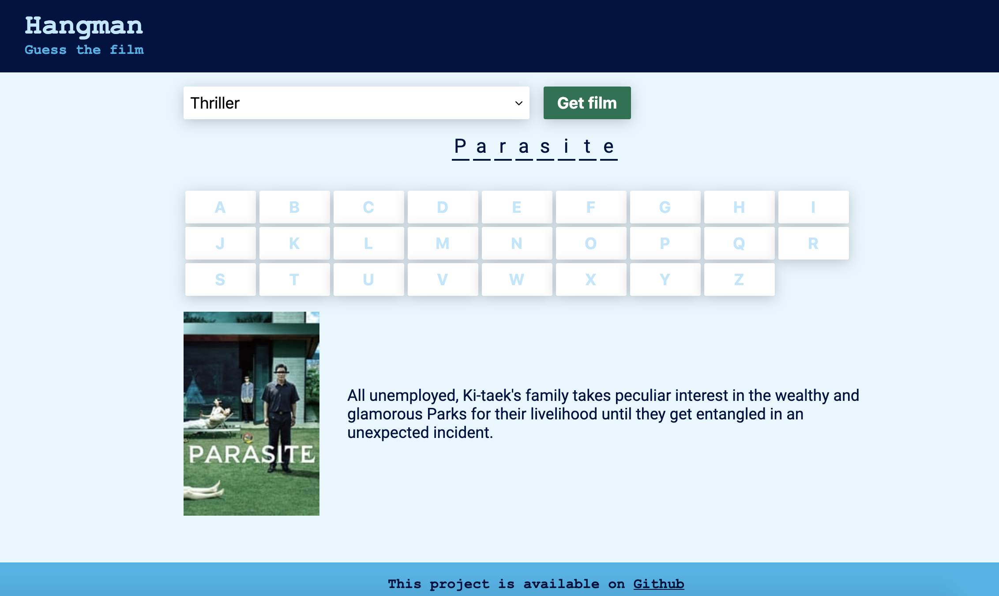

# Hangman React 

<strong><a href="https://zurda.github.io/hangman-react/">Here's the project link</a></strong>

This is my first project for 2020. The main goal of this project was speed: I wanted something I can set up quickly to kick this year off with something fun. 

I created a hangman game that pulls film genres and film info from the MovieDB api. 

The project was created using `create-react-app`, `emotion`, and `typescript` (although types were a last day addition, and are still a WIP). Also used `prettier`, `gh-pages`, Github Actions, `eslint` which was later on swapped for `tslint`. 

### Planning Process

I started this on January 1, 2020. Here's a list of things I wrote down when planning this project. I find it interesting that the last item on this list was what I started with (genre dropdown):

- Create the app 
- Create header, footer
- Make api call 
- Fetch one movie to display on screen 
- Hide movie on screen 
- Display alphabet 
- Keep guessed alphabet and make unclickable 
- Display letters that have been selected 
- Button to start game 
- Button to give up and restart game 
- Display remaining tries 
- Display game over / game won! 
- Add play again option 
- Add poster reveal option 
- Add linter 
- Add tests 
- Add difficulty levels 
- Allow chossing genre 

### Things I've learned 

- Gained practice in **setting up a project quickly**. One of my goals were to have something I'll feel reasonabely comfortable sharing after **one week** of work.

- Tried **Github Actions**: I started with setting up a deployer for master branch, and later split the lint and formatting tests to also run on PRs.

- Converted to **Typescript** (day 7): I got to experience the process of converting the project to TS file by file while following error messages. This was a lot easier than expected thanks to VScode (Types are still a WIP - forgive me padre). 

- Something that took way too long to figure out: In order to use prettier in Actions the package needs to be installed in the dependencies rather than devDependencies if unning `yarn install`. 

- Set up two different `.yml` files: one for PRs that runs the lint and format test, and another that runs these tests + deploys. 

- Used **Github secrets**. 

- I was really excited to discover a field with the type `number | null` in the api documentation, but soon after discovered that particular field was practically always null (!). This was an important lesson about **data availability, and api documentation** (the short version being: don't get your hopes up before you try it :) )

### Still to do

- Types fixes and tweaks

- Add tests (visual, api, interface)

- Fix bug: when the film name is too long it slides off of screen

- Explore more things in the api: tv shows, integration with IMDB, integrate youtube for trailers

- Ability to peak into a section of the movie poster as a hint 

- There are probably other issues, but these are the next priorities

This is it for now. See you on project #2 (I hope)